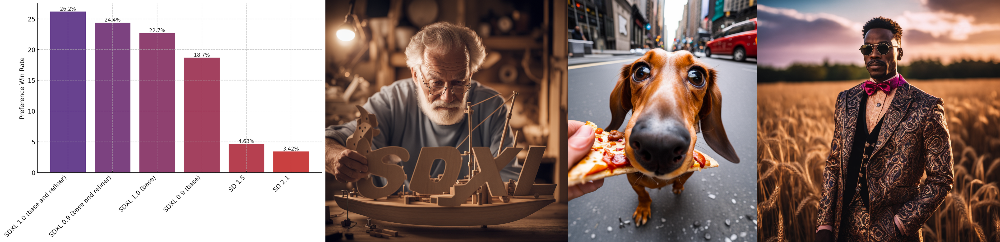

# Генеративные модели от Stability AI


## Новости
**30 ноября 2023 г.**
- После запуска SDXL-Turbo мы выпускаем [SD-Turbo](https://huggingface.co/stabilityai/sd-turbo).

**28 ноября 2023 г.**
- Мы выпускаем SDXL-Turbo, молниеносную модель преобразования текста в изображения.
  Одновременно с моделью мы публикуем [технический отчет](https://stability.ai/research/adversarial-diffusion-distillation).
    - Использование:
        - Следуйте инструкциям по установке или обновите существующую среду с помощью `pip installstreamlit-keyup`.
        - Загрузите [гири](https://huggingface.co/stabilityai/sdxl-turbo) и поместите их в каталог `checkpoints/`.
        - Запустите `streamlit run scripts/demo/turbo.py`.

  


**21 ноября 2023 г.**
- Мы выпускаем Stable Video Diffusion, модель преобразования изображения в видео, для исследовательских целей:
    - [SVD](https://huggingface.co/stabilityai/stable-video-diffusion-img2vid): эта модель была обучена генерировать 14
      кадры с разрешением 576x1024 с учетом контекстного кадра того же размера.
      Мы используем стандартный кодировщик изображений из SD 2.1, но заменяем декодер временным «декодером мерцания».
    - [SVD-XT](https://huggingface.co/stabilityai/stable-video-diffusion-img2vid-xt): та же архитектура, что и у SVD, но с тонкой настройкой.
      для генерации 25 кадров.
    - Мы предоставляем потоковую демонстрационную версию `scripts/demo/video_sampling.py` и отдельный скрипт Python `scripts/sampling/simple_video_sample.py` для вывода обеих моделей.
    - Одновременно с моделью мы публикуем [технический отчет](https://stability.ai/research/stable-video-diffusion-scaling-latent-video-diffusion-models-to-large-datasets).

  

**26 июля 2023 г.**

- Мы выпускаем две новые открытые модели с
  разрешительная [лицензия CreativeML Open RAIL++-M](model_licenses/LICENSE-SDXL1.0) (см. файл [Inference](#inference)
  хеши):
    - [SDXL-base-1.0](https://huggingface.co/stabilityai/stable-diffusion-xl-base-1.0): улучшенная версия.
      поверх `SDXL-base-0.9`.
    - [SDXL-refiner-1.0](https://huggingface.co/stabilityai/stable-diffusion-xl-refiner-1.0): улучшенная версия.
      над `SDXL-refiner-0.9`.



**4 июля 2023 г.**

- Технический отчет по SDXL теперь доступен [здесь] (https://arxiv.org/abs/2307.01952).

**22 июня 2023 г.**

- Мы выпускаем две новые модели диффузии для исследовательских целей:
    - `SDXL-base-0.9`: базовая модель была обучена на различных соотношениях сторон изображений с разрешением 1024^2. 
      базовая модель использует [OpenCLIP-ViT/G](https://github.com/mlfoundations/open_clip)
      и [CLIP-ViT/L](https://github.com/openai/CLIP/tree/main) для кодирования текста, тогда как модель уточнения использует только
      модель OpenCLIP.
    - `SDXL-refiner-0.9`: очиститель обучен шумоподавлению небольших уровней шума в высококачественных данных и поэтому
      не ожидается, что он будет работать в качестве модели преобразования текста в изображение; вместо этого его следует использовать только как модель преобразования изображения в изображение.

Если вы хотите получить доступ к этим моделям для своих исследований, подайте заявку, воспользовавшись одной из следующих ссылок:
[SDXL-0.9-Базовая модель](https://huggingface.co/stabilityai/stable-diffusion-xl-base-0.9),
и [SDXL-0.9-Refiner](https://huggingface.co/stabilityai/stable-diffusion-xl-refiner-0.9).
Это означает, что вы можете подать заявку на любую из двух ссылок, и если вам будет предоставлено разрешение, вы сможете получить доступ к обеим.
Пожалуйста, войдите в свою учетную запись Hugging Face, используя адрес электронной почты вашей организации, чтобы запросить доступ.
**Мы планируем выпустить полную версию в ближайшее время (июль).**

## Кодовая база

### Общая философия

Модульность превыше всего. В этом репозитории реализован подход, основанный на конфигурации, при котором мы создаем и объединяем подмодули с помощью
вызов `instantiate_from_config()` для объектов, определенных в конфигурациях yaml. См. `configs/` для многих примеров.

### Список изменений старой кодовой базы `ldm`

Для обучения мы используем [PyTorch Lightning](https://lightning.ai/docs/pytorch/stable/), но использовать и другие должно быть легко.
обучающие оболочки вокруг базовых модулей. Базовый класс модели диффузии (ранее «LatentDiffusion»,
теперь `DiffusionEngine`) очищен:

- Никаких более обширных подклассов! Теперь мы обрабатываем все типы вводных данных (векторы, последовательности и пространственные данные).
  условия и все их комбинации) в одном классе: GeneralConditioner,
  см. `sgm/modules/encoders/modules.py`.
- Мы отделяем направляющие (например, руководство без классификаторов, см. `sgm/modules/diffusionmodules/guiders.py`) от
  семплеры (`sgm/modules/diffusionmodules/sampling.py`), причем сэмплеры не зависят от модели.
- Мы используем ["структуру шумоподавления"](https://arxiv.org/abs/2206.00364) как для обучения, так и для вывода (наиболее примечательным является
  изменение, вероятно, теперь является возможностью обучения моделей непрерывного времени):
    * Модели дискретного времени (шумоподавители) — это просто частный случай моделей непрерывного времени (шумоподавители);
      см. `sgm/modules/diffusionmodules/denoiser.py`.
    * Следующие функции теперь независимы: взвешивание диффузионных потерь
      функция (`sgm/modules/diffusionmodules/denoiser_weighting.py`), предварительная обработка
      сети (`sgm/modules/diffusionmodules/denoiser_scaling.py`) и выборку уровней шума во время
      обучение (`sgm/modules/diffusionmodules/sigma_sampling.py`).
- Модели автокодирования также были очищены.

## Монтаж:

<a name="установка"></a>

#### 1. Клонируйте репозиторий

```ракушка
git-клон https://github.com/Stability-AI/generative-models.git
генеративные модели компакт-дисков
```

#### 2. Настройка virtualenv

Предполагается, что после клонирования вы перешли в корень «generative-models».

**ПРИМЕЧАНИЕ.** Это проверено под `python3.10`. В других версиях Python вы можете столкнуться с конфликтами версий.

**ПиТорч 2.0**

```ракушка
# устанавливаем необходимые пакеты из pypi
python3 -m венв.pt2
источник .pt2/bin/activate
pip3 install -r требования/pt2.txt
```

#### 3. Установите `sgm`

```ракушка
установить pip3.
```

#### 4. Установите `sdata` для обучения

```ракушка
pip3 install -e git+https://github.com/Stability-AI/datapipelines.git@main#egg=sdata
```

## Упаковка

В этом репозитории используется упаковка, совместимая с PEP 517, с использованием [Hatch](https://hatch.pypa.io/latest/).

Чтобы собрать распространяемое колесо, установите «hatch» и запустите «hatch build».
(указание `-twheel` пропустит построение sdist, в этом нет необходимости).

```
пип установить люк
сборка люка -t колесо
```

Вы найдете собранный пакет в `dist/`. Вы можете установить колесо с помощью `pip install dist/*.whl`.

Обратите внимание, что в настоящее время пакет **не** определяет зависимости; вам нужно будет установить необходимые пакеты,
в зависимости от вашего варианта использования и версии PyTorch, вручную.

## Вывод

Мы предоставляем демонстрационную версию [streamlit](https://streamlit.io/) для преобразования текста в изображение и изображения в изображение.
в `scripts/demo/sampling.py`.
Мы предоставляем хэши файлов для всего файла, а также только для сохраненных тензоров в файле (
см. [Спецификация модели] (https://github.com/Stability-AI/ModelSpec) для сценария для ее оценки).
На данный момент поддерживаются следующие модели:

- [SDXL-base-1.0](https://huggingface.co/stabilityai/stable-diffusion-xl-base-1.0)
  ```
  Хэш файла (sha256): 31e35c80fc4829d14f90153f4c74cd59c90b779f6afe05a74cd6120b893f7e5b
  Хэш Tensordata (sha256): 0xd7a9105a900fd52748f20725fe52fe52b507fd36bee4fc107b1550a26e6ee1d7
  ```
- [SDXL-refiner-1.0](https://huggingface.co/stabilityai/stable-diffusion-xl-refiner-1.0)
  ```
  Хэш файла (sha256): 7440042bbdc8a24813002c09b6b69b64dc90fded4472613437b7f55f9b7d9c5f
  Хэш Tensordata (sha256): 0x1a77d21bebc4b4de78c474a90cb74dc0d2217caf4061971dbfa75ad406b75d81
  ```
- [SDXL-base-0.9](https://huggingface.co/stabilityai/stable-diffusion-xl-base-0.9)
- [SDXL-refiner-0.9](https://huggingface.co/stabilityai/stable-diffusion-xl-refiner-0.9)
- [SD-2.1-512](https://huggingface.co/stabilityai/stable-diffusion-2-1-base/blob/main/v2-1_512-ema-pruned.safetensors)
- [SD-2.1-768](https://huggingface.co/stabilityai/stable-diffusion-2-1/blob/main/v2-1_768-ema-pruned.safetensors)

**Вес для SDXL**:

**SDXL-1.0:**
Доступны гири SDXL-1.0 (в зависимости от
[лицензию CreativeML Open RAIL++-M](model_licenses/LICENSE-SDXL1.0)) здесь:

- базовая модель: https://huggingface.co/stabilityai/stable-diffusion-xl-base-1.0/
- модель рафинера: https://huggingface.co/stabilityai/stable-diffusion-xl-refiner-1.0/

**SDXL-0.9:**
Веса SDXL-0.9 доступны и подлежат [исследовательской лицензии](model_licenses/LICENSE-SDXL0.9).
Если вы хотите получить доступ к этим моделям для своих исследований, подайте заявку, воспользовавшись одной из следующих ссылок:
[модель SDXL-base-0.9](https://huggingface.co/stabilityai/stable-diffusion-xl-base-0.9),
и [SDXL-refiner-0.9](https://huggingface.co/stabilityai/stable-diffusion-xl-refiner-0.9).
Это означает, что вы можете подать заявку на любую из двух ссылок, и если вам будет предоставлено разрешение, вы сможете получить доступ к обеим.
Пожалуйста, войдите в свою учетную запись Hugging Face, используя адрес электронной почты вашей организации, чтобы запросить доступ.

После получения весов поместите их в `checkpoints/`.
Затем запустите демо-версию, используя

```
runlit run scripts/demo/sampling.py --server.port <ваш_порт>
```

### Обнаружение невидимых водяных знаков

Изображения, созданные с помощью нашего кода, используют
[невидимый-водяной знак](https://github.com/ShieldMnt/invisible-watermark/)
библиотека для встраивания невидимого водяного знака в выходные данные модели. Мы также предоставляем
сценарий, позволяющий легко обнаружить этот водяной знак. Обратите внимание, что этот водяной знак
не такой, как в предыдущих версиях Stable Diffusion 1.x/2.x.

Для запуска скрипта вам необходимо либо иметь работающую установку, как указано выше, либо
попробуйте _экспериментальный_ импорт, используя только минимальное количество пакетов:

``` баш
python -m venv.detect
источник .detect/bin/activate

pip install "numpy>=1.17" "PyWavelets>=1.1.1" "opencv-python>=4.1.0.25"
pip install --no-deps невидимый-водяной знак
```

Для запуска скрипта вам необходима рабочая установка, как указано выше. Сценарий
затем можно будет использовать следующими способами (не забудьте активировать
виртуальную среду заранее, например `source .pt1/bin/activate`):

``` баш
#проверяем один файл
python scripts/demo/detect.py <здесь ваше имя файла>
# проверка нескольких файлов одновременно
python scripts/demo/detect.py <имя файла 1> <имя файла 2> ... <имя файла n>
#проверяем все файлы в определенной папке
python scripts/demo/detect.py <здесь имя вашей папки>/*
```

## Обучение:

Мы предоставляем примеры конфигураций обучения в `configs/example_training`. Чтобы запустить обучение, запустите

```
python main.py --base configs/<config1.yaml> configs/<config2.yaml>
```

где конфиги объединяются слева направо (более поздние конфиги перезаписывают одни и те же значения).
Это можно использовать для объединения конфигураций модели, обучения и данных. Однако все они также могут быть
определено в одной конфигурации. Например, чтобы запустить обучение модели диффузии на основе пикселей на основе классов в MNIST,
бегать

``` баш
python main.py --base configs/example_training/toy/mnist_cond.yaml
```

**ПРИМЕЧАНИЕ 1.** Использование набора данных, не относящегося к игрушкам.
конфиги `configs/example_training/imagenet-f8_cond.yaml`, `configs/example_training/txt2img-clipl.yaml`
и `configs/example_training/txt2img-clipl-legacy-ucg-training.yaml` для обучения потребуют правок в зависимости от
используемый набор данных (который, как ожидается, будет храниться в tar-файле в
[формат набора данных](https://github.com/webdataset/webdataset)). Чтобы найти детали, которые необходимо адаптировать, выполните поиск
для комментариев, содержащих `USER:` в соответствующей конфигурации.

**ПРИМЕЧАНИЕ 2.** Этот репозиторий поддерживает как pytorch1.13, так и pytorch2 для обучения генеративных моделей. Однако для
обучение автоэнкодера, например, в `configs/example_training/autoencoder/kl-f4/imagenet-attnfree-logvar.yaml`,
поддерживается только pytorch1.13.

**ПРИМЕЧАНИЕ 3:** Для обучения скрытых генеративных моделей (например, в `configs/example_training/imagenet-f8_cond.yaml`) требуется
получение контрольной точки из [Hugging Face](https://huggingface.co/stabilityai/sdxl-vae/tree/main) и замена
заполнитель `CKPT_PATH` в [этой строке](configs/example_training/imagenet-f8_cond.yaml#81). То же самое предстоит сделать
для предоставленных конфигураций преобразования текста в изображение.

### Создание новых моделей диффузии

#### Кондиционер

«GeneralConditioner» настраивается через «conditioner_config». Его единственный атрибут — `emb_models`, список
различные средства внедрения (все унаследованы от AbstractEmbModel), которые используются для формирования генеративной модели.
Все разработчики должны определить, являются ли они обучаемыми («is_trainable», по умолчанию «False»), без классификаторов.
используется частота выпадения указаний (ucg_rate, по умолчанию 0) и ключ ввода (input_key), например, txt для
текстовое условие или `cls` для условий класса.
При вычислении условий программа внедрения получит в качестве входных данных `batch[input_key]`.
В настоящее время мы поддерживаем двух- и четырехмерные условия, а условия различных средств внедрения объединяются.
соответствующим образом.
Обратите внимание, что порядок встраивания в `conditioner_config` важен.

#### Сеть

Нейронная сеть настраивается через `network_config`. Раньше это называлось `unet_config`, что не является общим
достаточно, поскольку мы планируем экспериментировать с диффузионными магистралями на основе трансформаторов.

#### Потеря

Потеря настраивается через `loss_config`. Для стандартного обучения модели диффузии вам придется
установите `sigma_sampler_config`.

#### Конфигурация семплера

Как обсуждалось выше, сэмплер не зависит от модели. В `sampler_config` мы устанавливаем тип числового значения.
решатель, количество шагов, тип дискретизации, а также, например, направляющие обертки для безклассификатора
руководство.

### Обработка набора данных

Для крупномасштабного обучения мы рекомендуем использовать конвейеры данных из
наш проект [конвейеры данных](https://github.com/Stability-AI/datapipelines). Проект содержится в требовании
и автоматически включается при выполнении шагов из [раздела установки](#installation).
Небольшие наборы данных в стиле карты должны быть определены здесь, в репозитории (например, MNIST, CIFAR-10, ...) и возвращать значение
ключи/значения данных,
например,

``` питон
example = {"jpg": x, # это тензор -1...1 chw
           "txt": "красивое изображение"}
```

где мы ожидаем изображения в формате -1...1, в формате «сначала канал».